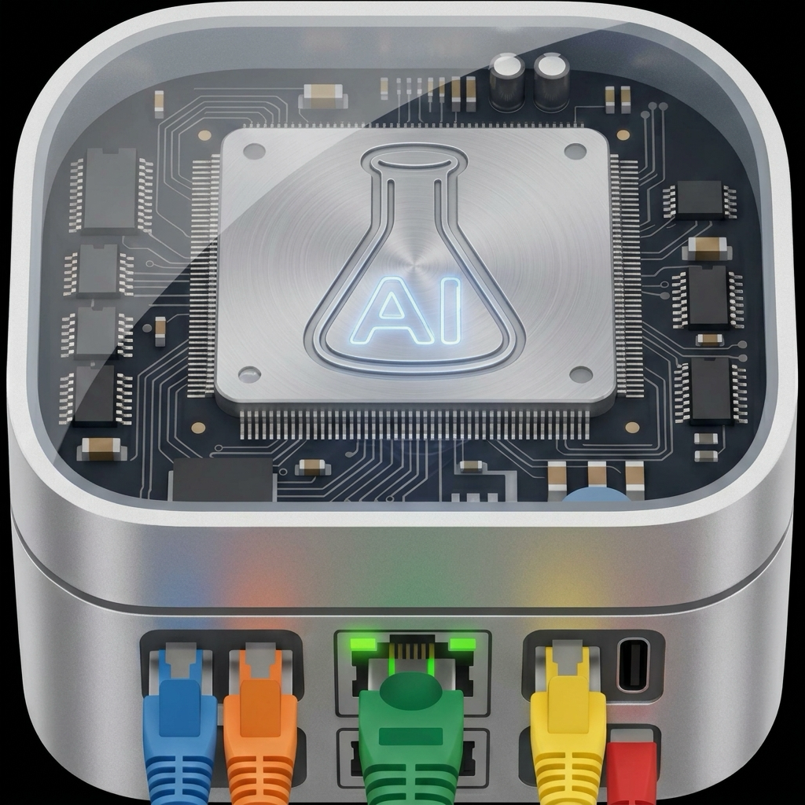
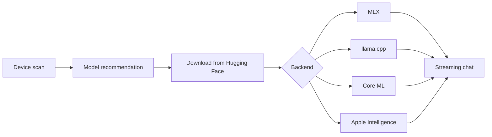

<div align="center">



# Pocket AI Lab

**A tiny data center in your pocket.**
Run large language models entirely on your iPhone — no cloud, no accounts, no data ever leaving the device.

[](#requirements)
[](#tech-stack)
[](#importing-any-model)
[](LICENSE)

</div>

---

## What it does

Pocket AI Lab scans your device, tells you honestly which models will actually fit, downloads them straight from Hugging Face, and lets you chat with them fully offline.

- **Multi-backend inference** — MLX, llama.cpp (GGUF), Core ML, and Apple Intelligence, switchable at runtime
- **Multimodal** — text, images and video frames (vision models), speech-to-text (Whisper)
- **Import any model by link** — paste a Hugging Face URL, pick a quantization, get a fit verdict before a single byte downloads
- **Honest memory budgets** — recommendations are computed from the real per-process memory limits of *your* device, not marketing RAM numbers
- **Live metrics** — CPU, RAM and thermal pressure while the model is thinking
- **Streaming chat** — token-by-token, with full conversation history on every backend

## How it works



1. **Scan** — the app reads the chip, RAM, free disk, and the *actual* memory allowance iOS grants the process (entitlement-aware), plus the Metal working-set ceiling.
2. **Recommend** — the model catalog is filtered against two separate budgets: copied-weight backends (MLX, Core ML) are judged by the strict jetsam allowance, mmap-backed backends (llama.cpp, whisper.cpp) by the higher Metal working set.
3. **Download** — files stream over a background `URLSession` pinned to an exact repo revision; downloads survive app restarts.
4. **Chat** — every backend implements one streaming `InferenceEngine` protocol; the UI neither knows nor cares which runtime is generating your tokens.

The model catalog itself lives [in this repository](local_ai_test/Resources/catalog.json) — the app periodically refreshes it from here, so new models can appear without an App Store update. No server involved.

## Importing any model

Models tab → **⊕** → paste a link like `bartowski/Llama-3.2-1B-Instruct-GGUF`:

1. The repo is validated through the Hugging Face API (gated repos are detected and explained)
2. The file listing is analyzed: GGUF / safetensors / Core ML / Whisper weights are auto-detected
3. You pick a quantization (Q4_K_M preselected) and see a RAM / disk verdict for your device
4. Download — and the model appears in chat, surviving relaunches

## Tech stack

| Layer | Technology |
|---|---|
| UI | SwiftUI, Swift Charts |
| Text inference | [MLX Swift](https://github.com/ml-explore/mlx-swift-examples) · [llama.cpp](https://github.com/ggml-org/llama.cpp) |
| Vision | MLX-VLM · llama.cpp + libmtmd (GGUF vision) |
| Speech-to-text | [whisper.cpp](https://github.com/ggml-org/whisper.cpp) |
| Core ML path | [swift-transformers](https://github.com/huggingface/swift-transformers) |
| System model | Apple Intelligence (FoundationModels) |
| Model hub | Hugging Face public API |

## Requirements

- iOS 26+, iPhone 15 or newer (6 GB+ RAM for local models)
- Xcode 26+ to build

## Building

```bash
git clone https://github.com/ananasDDA/pocket-ai-lab.git
cd pocket-ai-lab

# Fetch the vendored llama.cpp / whisper.cpp XCFrameworks (gitignored):
./Scripts/install_xcframeworks.sh
# or, for GGUF vision support (libmtmd):
./Scripts/build_llama_mtmd_xcframework.sh

open local_ai_test.xcodeproj
```

Swift Package dependencies (mlx-swift-examples, swift-transformers) resolve automatically. Build on a **real device** — the Neural Engine and Apple Intelligence are not available in the simulator. See [Scripts/README.md](Scripts/README.md) for XCFramework details.

## Privacy

There is no server. The app talks to exactly two hosts: `huggingface.co` (model downloads and metadata) and `raw.githubusercontent.com` (catalog updates). Conversations never leave the device.

## Acknowledgements

Built on the shoulders of [MLX](https://github.com/ml-explore/mlx), [llama.cpp](https://github.com/ggml-org/llama.cpp), [whisper.cpp](https://github.com/ggml-org/whisper.cpp) and [swift-transformers](https://github.com/huggingface/swift-transformers) — all MIT/Apache licensed. Model weights are downloaded from their respective Hugging Face repositories and remain subject to their own licenses.

## License

[MIT](LICENSE) © Daniil Dorokhov
